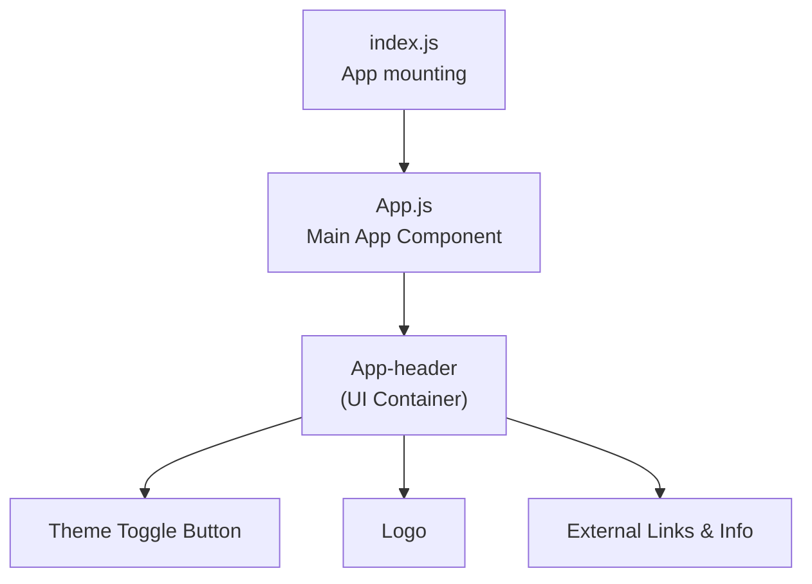

# Wordsearch Frontend: Architecture, Features, Design, and Requirements

## 1. Project Overview

The wordsearch frontend is a modern, minimalistic React web application that enables users to interactively play a wordsearch game. The application is structured for responsiveness, quick load times, and user engagement through a simple UI and dynamic theming. It serves as the user interface layer for the project, focusing on seamless interaction, fast rendering, and visually appealing presentation.

---

## 2. Features

- **Interactive wordsearch puzzle grid**: Intended support for dynamic wordsearch boards where users can select letters and highlight discovered words.
- **Highlighting found words**: Visual feedback when users find and select correct words in the grid.
- **Dynamic puzzle generation**: Future support for generating new wordsearch puzzles on demand.
- **Game timer and scoring**: Planned timing and scoring system to track player performance.
- **Responsive design**: Fully usable on both mobile and desktop, with flexible layouts and adaptable controls.
- **Theme toggling**: Switch between light and dark modes with a single button, preserving accessibility and clarity.
- **Restart and new game functionality**: Room for implementing reset and generation of new puzzle boards.

> **Note:** As of the current implementation, the skeleton for these features exists, but detailed game logic (e.g., grid display, word selection) may still need to be implemented.

---

## 3. System Architecture

This frontend React project is designed with simplicity and extensibility in mind. Its structure allows for rapid prototyping while remaining open to future expansion.

### High-level Structure

- `src/App.js`: Main application entry point, responsible for rendering the root layout, handling theme toggling, and centralizing global UI functions.
- `src/App.css`: Maintains style definitions, theming variables, component-level CSS, responsive layouts, and visual branding.
- `src/index.js`: Renders the main App component into the DOM using ReactDOM.
- `package.json`: Lists project metadata, dependencies (React, React DOM, React Scripts), build/test scripts, and browser compatibility settings.

### Component Overview


- The main App component manages overall rendering and global state (e.g., theme selection).
- A header section holds the main UI, including the theming switch, logo, instructional text, and navigation links.

---

## 4. Design

### Visual and Layout Design

- **Modern and Minimal UI**: The UI is uncluttered, making use of whitespace, soft colors, and modern typography for ease of navigation.
- **Brand-Aware Colors**: Primary, secondary, and accent colors are defined as CSS variables. Themes are applied by toggling the `data-theme` attribute on the HTML element.
- **Responsive Layout**: CSS media queries ensure usability on mobile and desktop, especially for essential controls like the theme toggle.
- **Component Styling**: All major UI components/styles reside in `App.css`, avoiding heavy UI dependencies, encouraging customization.

#### Sample Theme Variables (from App.css)
```css
:root {
  --bg-primary: #ffffff;
  --bg-secondary: #f8f9fa;
  --text-primary: #282c34;
  --button-bg: #007bff;
  /* etc. */
}
[data-theme="dark"] {
  --bg-primary: #1a1a1a;
  --text-primary: #ffffff;
  /* etc. */
}
```
A theme toggle button is provided to switch between "light" and "dark" modes, enhancing accessibility and user comfort.

---

## 5. Functional Requirements

- **Theme Switching**: Users can toggle between light and dark modes by clicking the designated button. The application’s colors update instantly without a page refresh.
- **Responsive UI**: All interactive elements and layouts must appear correctly and remain usable across a wide range of screen sizes.
- **Accessibility**: Sufficient color contrast, large clickable areas (for the toggle button), and semantic HTML ensure baseline accessibility.
- **Performance**: The frontend is optimized for fast loads (minimal dependencies, efficient styles).

### Future/Planned Requirements

- **Game Grid Rendering**: Display a puzzle board where users can select/hightlight words.
- **Word Highlighting Logic**: Detect and visually mark words as found.
- **Game Timer and Scoring**: Show elapsed game time and calculate scores based on performance.
- **New Game/Restart**: Allow users to reset or request a new puzzle.
- **State Persistence**: Use browser local storage or state management for saving progress.

---

## 6. Technical Stack

- **React**: Interface rendering and state management.
- **Vanilla CSS**: Styling, themes, and layout control (found in `App.css` and `index.css`).
- **No external component libraries** (by design): Encourages a small bundle size and customizability.
- **Build & Tooling**: React Scripts, ESLint, and testing via Jest (with basic starter setup in `setupTests.js`).
- **Browser Compatibility**: Supports last few major Chrome, Firefox, and Safari versions as specified in `package.json`.

---

## 7. Project Structure

```
wordsearch_frontend/
  ├── kavia-docs/                      # Architectural, design, and requirements documentation (this file)
  ├── src/
  │   ├── App.js                       # Main React app component
  │   ├── App.css                      # Application and theming styles
  │   ├── index.js                     # Root rendering file
  │   ├── index.css                    # Global CSS resets and typography
  │   ├── setupTests.js                # Test setup with jest-dom
  │   └── App.test.js                  # Example test for starter
  ├── package.json                     # Manifest: scripts, dependencies, config
  ├── README.md                        # Quick project intro and customization notes
```

---

## 8. Notable Design Patterns

- **Single Responsibility Components**: Each file/component is focused on a distinct UI or application concern.
- **CSS Variables/Theming**: Easy future theme expansion and customization.
- **Hooks-Based State Management**: React hooks (`useState`, `useEffect`) provide for simple but effective UI state.

---

## 9. Extending the Application

To add features such as the wordsearch game grid, puzzle logic, or scoring:
- Create new UI components inside `src/`.
- Centralize state in top-level `App` or via context/hooks as the project grows.
- Extend `App.css` with new component selectors.
- Integrate additional utilities or libraries as needed for advanced game mechanics.

---

## 10. References

- [React Documentation](https://reactjs.org/)
- [Create React App: User Guide](https://create-react-app.dev/)
- [Modern JS and CSS](https://developer.mozilla.org/)

---

*This documentation is current as of the latest codebase state. Please update if significant architecture, features, or design changes occur.*
